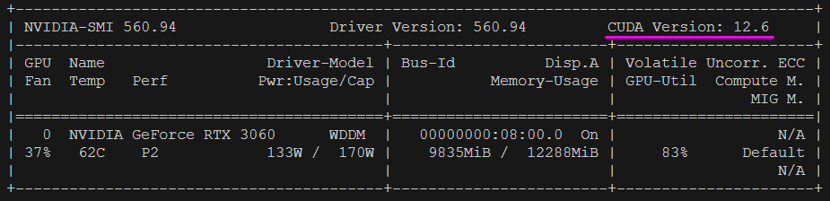
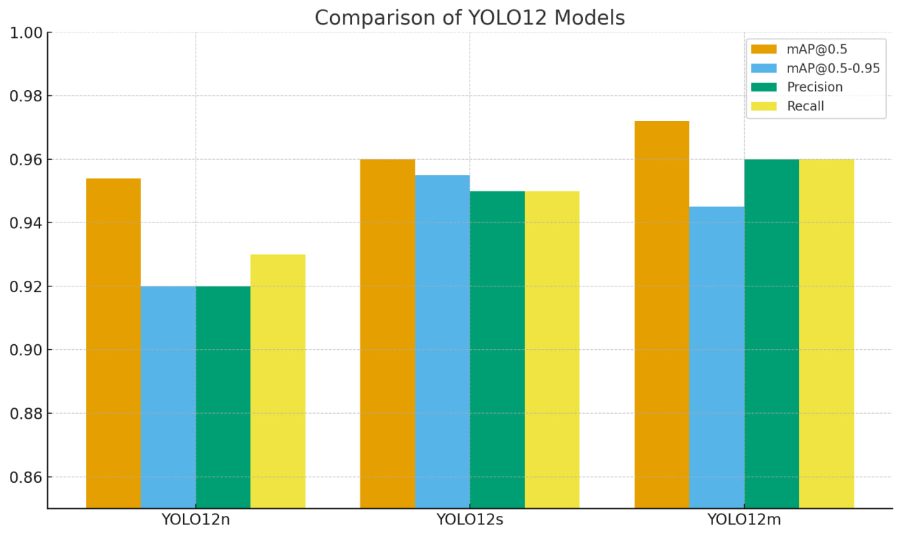
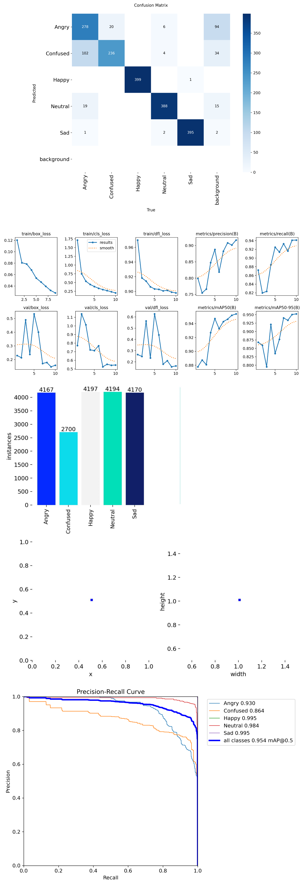
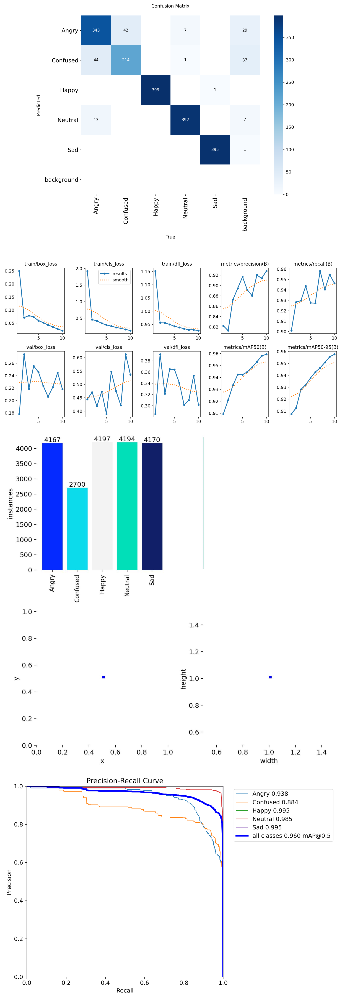
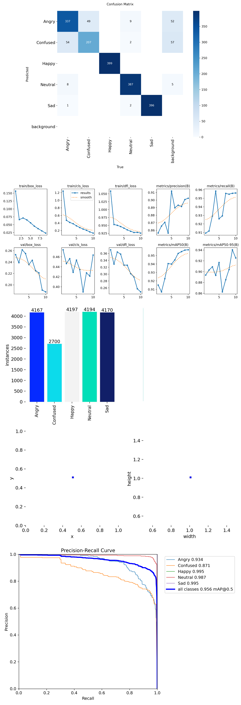

## Детекция эмоций YOLOv12


Этот проект представляет собой полнофункциональное решение для детекции эмоций, построенное на архитектуре YOLOv12.        
Проект обучает и запускает модель, которая определяет эмоции на лице в режиме реального времени.

## Быстрый запуск (последовательность)
**1. Клонирование проекта и создание виртуальной среды**
```bash
git clone https://github.com/oryx3422/vtsk
cd vtsk
py -m venv venv              # установка интерпретатора 
.\venv\Scripts\Activate.ps1  # для виртуальной среды
```
**2. Установка зависимостей**
```bash
pip install -r requirements.txt  # установка зависимостей проекта 
```

**3. Загрузка датасета Roboflow**

Перед выполнением укажите ваш Private API Key с https://roboflow.com
```bash
python start.py  # загрузит датасет через Roboflow
```

**Проверка CUDA (опционально)**
```bash
nvidia-smi      # В выводе будет строка: CUDA Version: *.*
python test.py  # Скрипт `test.py` выведет `CUDA доступна: True/False` и название GPU.
```


При необходимости, если установка PyTorch не сработала
```bash
pip install torch torchvision torchaudio --index-url https://download.pytorch.org/whl/cu121
```

**4. Обучение модели**
Базовый сценарий (10 эпох, imgsz=512)

Параметры:
- `cache=True` ( отключите, если RAM < 16 ГБ )
```bash
python train.py
```

**5. Запуск веб-камеры с определением эмоций в режиме реального времени.**

Замените на свой путь к `best.pt`  !!!

Нажмите `ESC`, чтобы закрыть окно opencv
```bash
python realTime.py  # работает после обучения
```
Скрипт использует обученные веса `best.pt`, автоматически полученные после обучения.

---



---

## Результаты модели yolo12n
- Классы: Angry, Confused, Happy, Neutral, Sad
- Обучение: 10 эпох, YOLOv12n
- `mAP@0.5 = 0.954`, `mAP@0.5-0.95 ≈ 0.92`
- `Precision ≈ 0.92`, `Recall ≈ 0.93`




## Результаты модели yolo12s

- Классы: Angry, Confused, Happy, Neutral, Sad
- Обучение: 10 эпох, YOLOv12s
- `mAP@0.5 = 0.96`, `mAP@0.5-0.95 ≈ 0.955`
- `Precision ≈ 0.95`, `Recall ≈ 0.95`




## Результаты модели yolo12m
- Классы: Angry, Confused, Happy, Neutral, Sad
- Обучение: 10 эпох, YOLOv12m
- `mAP@0.5 = 0.956`, `mAP@0.5-0.95 ≈ 0.956`
- `Precision ≈ 0.955`, `Recall ≈ 0.956`



---

